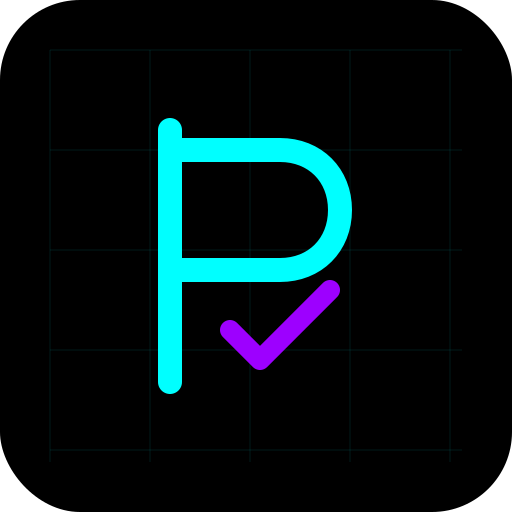

# ProjectTaskr - Advanced Project & Task Management System

<div align="center">
  
  <h3>Streamline Your Project Workflow</h3>
</div>

[](https://www.mongodb.com/)
[](https://expressjs.com/)
[](https://reactjs.org/)
[](https://nodejs.org/)
[](https://tailwindcss.com/)

A modern, full-stack MERN application for efficient project and task management with role-based access control, real-time updates, and a sleek, futuristic UI design.

## ✨ Features

### 🔐 Authentication & Security
- **Secure User Authentication**
  - JWT-based authentication with HTTP-only cookies for enhanced security
  - Password hashing with bcrypt and salting
  - Protection against common security vulnerabilities (XSS, CSRF)
- **Role-Based Authorization**
  - Admin role with full system access
  - Team member role with limited permissions
  - Middleware protection for sensitive routes
- **Security Measures**
  - API rate limiting to prevent brute force attacks
  - Input validation and sanitization
  - Secure HTTP headers implementation

### 📊 Project Management
- **Comprehensive Project Dashboard**
  - Visual project overview with status indicators
  - Progress tracking and completion metrics
  - Deadline monitoring and alerts
- **Admin Controls**
  - Create, edit, and delete projects
  - Assign team members to projects
  - Set project priorities and deadlines
- **Team Collaboration**
  - Shared project workspace
  - Real-time updates on project changes
  - Project history and activity logs

### ✅ Task Management
- **Advanced Task Features**
  - Tasks with title, description, assigned user, status, and priority
  - Subtasks and dependencies tracking
  - Due dates with reminder notifications
- **Powerful Filtering & Sorting**
  - Filter tasks by user, priority, status, deadline
  - Sort tasks by various criteria
  - Save custom filter configurations
- **Task Analytics**
  - Task completion rates
  - Time tracking and estimation
  - Performance metrics for team members

### 💬 Communication Tools
- **Comments System**
  - Rich text commenting on tasks
  - @mentions to notify team members
  - Comment history with timestamps
- **Notifications**
  - Email notifications for important updates
  - In-app notification center
  - Custom notification preferences

### 🎨 UI/UX Features
- **Modern Futuristic Design**
  - Dark theme with neon accents
  - Responsive layout for all devices
  - Smooth animations and transitions
- **Intuitive Navigation**
  - Logical workflow organization
  - Quick access shortcuts
  - Contextual menus and actions
- **Accessibility**
  - WCAG compliance features
  - Keyboard navigation support
  - Screen reader compatibility

### 🚀 Performance & Optimization
- **Fast Loading Times**
  - Optimized API requests and responses
  - Efficient state management
  - Lazy loading of components
- **Deployment Optimizations**
  - Handling of Render free tier cold starts
  - Dynamic CORS configuration for Vercel preview deployments
  - Extended timeout settings for API requests

## 💻 Tech Stack

### Frontend
- **React 18** - Modern UI library for building interactive user interfaces
- **Context API** - For efficient state management across components
- **React Router v6** - For declarative routing and navigation
- **Axios** - Promise-based HTTP client for API requests with interceptors
- **TailwindCSS** - Utility-first CSS framework for custom designs
- **React Toastify** - For elegant notifications and alerts
- **React Icons** - For comprehensive icon library
- **Vite** - Next-generation frontend tooling for faster development

### Backend
- **Node.js** - JavaScript runtime for server-side execution
- **Express.js** - Fast, unopinionated web framework for Node.js
- **JWT (jsonwebtoken)** - For secure authentication and authorization
- **bcryptjs** - For password hashing and security
- **Express-validator** - For input validation and sanitization
- **Helmet** - For securing HTTP headers
- **CORS** - For Cross-Origin Resource Sharing configuration
- **Rate-limiting** - For API request throttling and protection
- **Morgan** - For HTTP request logging
- **Nodemon** - For automatic server restarts during development

### Database
- **MongoDB** - NoSQL database for flexible data storage
- **Mongoose** - Elegant MongoDB object modeling for Node.js
- **MongoDB Atlas** - Cloud database service for production deployment

### DevOps & Deployment
- **Git & GitHub** - For version control and code collaboration
- **Render** - For backend deployment and hosting
- **Vercel** - For frontend deployment and hosting
- **Environment Variables** - For secure configuration management
- **Cross-env** - For environment variable configuration across platforms

## 🔧 Getting Started

### Prerequisites
- **Node.js** (v14.x or higher)
- **npm** (v6.x or higher)
- **MongoDB** (local installation or MongoDB Atlas account)
- **Git** (for cloning the repository)

### Installation

1. **Clone the repository**
   ```bash
   git clone https://github.com/yourusername/projecttaskr.git
   cd projecttaskr
   ```

2. **Install server dependencies**
   ```bash
   cd Server
   npm install
   ```

3. **Install client dependencies**
   ```bash
   cd ../Client
   npm install
   ```

4. **Configure environment variables**

   Create a `.env` file in the Server directory with the following variables:
   ```env
   PORT=5001
   MONGO_URI=mongodb://localhost:27017/projecttaskr
   JWT_SECRET=your_jwt_secret_key_should_be_long_and_complex
   JWT_EXPIRE=30d
   CLIENT_URL=http://localhost:5173
   NODE_ENV=development
   ```

   Create a `.env` file in the Client directory with:
   ```env
   VITE_API_URL=http://localhost:5001/api
   ```

### Database Setup

1. **Start MongoDB** (if using local installation)
   ```bash
   # On Windows
   mongod

   # On macOS/Linux (if installed via Homebrew)
   brew services start mongodb-community
   ```

2. **Initialize the database** (optional)
   ```bash
   cd Server
   npm run db:init
   ```

### Running the Application

1. **Start the server** (in development mode with auto-restart)
   ```bash
   cd Server
   npm run dev
   ```

2. **Start the client** (in development mode with hot reload)
   ```bash
   cd Client
   npm run dev
   ```

3. **Access the application** at [http://localhost:5173](http://localhost:5173)

### Admin Account Setup

The application requires an admin user to create projects and assign tasks. You can create an admin account using the provided seeder script:

```bash
cd Server
npm run seed:admin
```

This will create an admin user with the following credentials:
- **Email**: admin@example.com
- **Password**: password123

You can also create a regular team member account using:

```bash
npm run seed:team
```

Or register a new account through the application's registration page (all new registrations are assigned the 'team-member' role by default).

### Testing the Application

1. **Run backend tests**
   ```bash
   cd Server
   npm test
   ```

2. **Run frontend tests**
   ```bash
   cd Client
   npm test
   ```

## 📝 API Documentation

### Base URL
- Local Development: `http://localhost:5001/api`
- Production: `https://projecttaskr-api.onrender.com/api`

### Authentication

All protected routes require a valid JWT token sent in the Authorization header:
```
Authorization: Bearer <your_jwt_token>
```

The token is automatically handled by the frontend and stored in an HTTP-only cookie.

### Authentication Routes

#### `POST /api/auth/register`
- **Description**: Register a new user
- **Access**: Public
- **Request Body**:
  ```json
  {
    "name": "John Doe",
    "email": "john@example.com",
    "password": "password123"
  }
  ```
- **Success Response**: `201 Created`
  ```json
  {
    "success": true,
    "token": "eyJhbGciOiJIUzI1NiIsInR5cCI6IkpXVCJ9...",
    "user": {
      "_id": "60d21b4667d0d8992e610c85",
      "name": "John Doe",
      "email": "john@example.com",
      "role": "team-member",
      "createdAt": "2023-06-22T10:30:40.526Z"
    }
  }
  ```

#### `POST /api/auth/login`
- **Description**: Login user
- **Access**: Public
- **Request Body**:
  ```json
  {
    "email": "john@example.com",
    "password": "password123"
  }
  ```
- **Success Response**: `200 OK`
  ```json
  {
    "success": true,
    "token": "eyJhbGciOiJIUzI1NiIsInR5cCI6IkpXVCJ9...",
    "user": {
      "_id": "60d21b4667d0d8992e610c85",
      "name": "John Doe",
      "email": "john@example.com",
      "role": "team-member"
    }
  }
  ```

#### `GET /api/auth/logout`
- **Description**: Logout user (clears the auth cookie)
- **Access**: Private
- **Success Response**: `200 OK`
  ```json
  {
    "success": true,
    "message": "Logged out successfully"
  }
  ```

#### `GET /api/auth/me`
- **Description**: Get current user's profile
- **Access**: Private
- **Success Response**: `200 OK`
  ```json
  {
    "success": true,
    "data": {
      "_id": "60d21b4667d0d8992e610c85",
      "name": "John Doe",
      "email": "john@example.com",
      "role": "team-member",
      "createdAt": "2023-06-22T10:30:40.526Z"
    }
  }
  ```

### Project Routes

#### `GET /api/projects`
- **Description**: Get all projects (paginated)
- **Access**: Private
- **Query Parameters**:
  - `page`: Page number (default: 1)
  - `limit`: Items per page (default: 10)
  - `search`: Search term for project name
  - `sort`: Sort field (e.g., createdAt, name)
  - `order`: Sort order (asc, desc)
- **Success Response**: `200 OK`
  ```json
  {
    "success": true,
    "count": 2,
    "pagination": {
      "total": 2,
      "pages": 1,
      "page": 1,
      "limit": 10
    },
    "data": [
      {
        "_id": "60d21b4667d0d8992e610c85",
        "name": "Website Redesign",
        "description": "Redesign company website with modern UI",
        "createdAt": "2023-06-22T10:30:40.526Z",
        "updatedAt": "2023-06-22T10:30:40.526Z"
      },
      {
        "_id": "60d21b4667d0d8992e610c86",
        "name": "Mobile App Development",
        "description": "Develop iOS and Android mobile apps",
        "createdAt": "2023-06-22T10:35:40.526Z",
        "updatedAt": "2023-06-22T10:35:40.526Z"
      }
    ]
  }
  ```

#### `GET /api/projects/:id`
- **Description**: Get single project by ID
- **Access**: Private
- **Success Response**: `200 OK`
  ```json
  {
    "success": true,
    "data": {
      "_id": "60d21b4667d0d8992e610c85",
      "name": "Website Redesign",
      "description": "Redesign company website with modern UI",
      "createdAt": "2023-06-22T10:30:40.526Z",
      "updatedAt": "2023-06-22T10:30:40.526Z"
    }
  }
  ```

#### `POST /api/projects`
- **Description**: Create new project
- **Access**: Private (Admin only)
- **Request Body**:
  ```json
  {
    "name": "New Project",
    "description": "This is a new project description"
  }
  ```
- **Success Response**: `201 Created`
  ```json
  {
    "success": true,
    "data": {
      "_id": "60d21b4667d0d8992e610c87",
      "name": "New Project",
      "description": "This is a new project description",
      "createdAt": "2023-06-22T11:30:40.526Z",
      "updatedAt": "2023-06-22T11:30:40.526Z"
    }
  }
  ```

#### `PUT /api/projects/:id`
- **Description**: Update project
- **Access**: Private (Admin only)
- **Request Body**:
  ```json
  {
    "name": "Updated Project Name",
    "description": "Updated project description"
  }
  ```
- **Success Response**: `200 OK`
  ```json
  {
    "success": true,
    "data": {
      "_id": "60d21b4667d0d8992e610c85",
      "name": "Updated Project Name",
      "description": "Updated project description",
      "createdAt": "2023-06-22T10:30:40.526Z",
      "updatedAt": "2023-06-22T11:45:40.526Z"
    }
  }
  ```

#### `DELETE /api/projects/:id`
- **Description**: Delete project
- **Access**: Private (Admin only)
- **Success Response**: `200 OK`
  ```json
  {
    "success": true,
    "data": {}
  }
  ```

#### `GET /api/projects/:projectId/tasks`
- **Description**: Get tasks for a specific project
- **Access**: Private
- **Query Parameters**: Same as GET /api/tasks
- **Success Response**: `200 OK` (Similar to GET /api/tasks but filtered by project)

### Task Routes

#### `GET /api/tasks`
- **Description**: Get all tasks (paginated)
- **Access**: Private
- **Query Parameters**:
  - `page`: Page number (default: 1)
  - `limit`: Items per page (default: 10)
  - `search`: Search term for task title
  - `status`: Filter by status (todo, in-progress, review, completed)
  - `priority`: Filter by priority (low, medium, high)
  - `assignedTo`: Filter by assigned user ID
  - `project`: Filter by project ID
  - `sort`: Sort field (e.g., createdAt, priority)
  - `order`: Sort order (asc, desc)
- **Success Response**: `200 OK`
  ```json
  {
    "success": true,
    "count": 2,
    "pagination": {
      "total": 2,
      "pages": 1,
      "page": 1,
      "limit": 10
    },
    "data": [
      {
        "_id": "60d21b4667d0d8992e610c88",
        "title": "Design Homepage",
        "description": "Create wireframes for homepage",
        "status": "in-progress",
        "priority": "high",
        "project": "60d21b4667d0d8992e610c85",
        "assignedTo": "60d21b4667d0d8992e610c90",
        "createdAt": "2023-06-22T10:30:40.526Z",
        "updatedAt": "2023-06-22T10:30:40.526Z"
      },
      {
        "_id": "60d21b4667d0d8992e610c89",
        "title": "Implement Login Page",
        "description": "Create login page with form validation",
        "status": "todo",
        "priority": "medium",
        "project": "60d21b4667d0d8992e610c85",
        "assignedTo": "60d21b4667d0d8992e610c91",
        "createdAt": "2023-06-22T10:35:40.526Z",
        "updatedAt": "2023-06-22T10:35:40.526Z"
      }
    ]
  }
  ```

#### `GET /api/tasks/:id`
- **Description**: Get single task by ID
- **Access**: Private
- **Success Response**: `200 OK`
  ```json
  {
    "success": true,
    "data": {
      "_id": "60d21b4667d0d8992e610c88",
      "title": "Design Homepage",
      "description": "Create wireframes for homepage",
      "status": "in-progress",
      "priority": "high",
      "project": {
        "_id": "60d21b4667d0d8992e610c85",
        "name": "Website Redesign"
      },
      "assignedTo": {
        "_id": "60d21b4667d0d8992e610c90",
        "name": "John Doe"
      },
      "createdAt": "2023-06-22T10:30:40.526Z",
      "updatedAt": "2023-06-22T10:30:40.526Z"
    }
  }
  ```

#### `POST /api/tasks`
- **Description**: Create new task
- **Access**: Private (Admin only)
- **Request Body**:
  ```json
  {
    "title": "New Task",
    "description": "This is a new task description",
    "status": "todo",
    "priority": "medium",
    "project": "60d21b4667d0d8992e610c85",
    "assignedTo": "60d21b4667d0d8992e610c90"
  }
  ```
- **Success Response**: `201 Created`
  ```json
  {
    "success": true,
    "data": {
      "_id": "60d21b4667d0d8992e610c8a",
      "title": "New Task",
      "description": "This is a new task description",
      "status": "todo",
      "priority": "medium",
      "project": "60d21b4667d0d8992e610c85",
      "assignedTo": "60d21b4667d0d8992e610c90",
      "createdAt": "2023-06-22T11:30:40.526Z",
      "updatedAt": "2023-06-22T11:30:40.526Z"
    }
  }
  ```

#### `PUT /api/tasks/:id`
- **Description**: Update task
- **Access**: Private (Admin or assigned user)
- **Request Body**: (All fields optional)
  ```json
  {
    "title": "Updated Task Title",
    "description": "Updated task description",
    "status": "in-progress",
    "priority": "high"
  }
  ```
- **Success Response**: `200 OK`
  ```json
  {
    "success": true,
    "data": {
      "_id": "60d21b4667d0d8992e610c88",
      "title": "Updated Task Title",
      "description": "Updated task description",
      "status": "in-progress",
      "priority": "high",
      "project": "60d21b4667d0d8992e610c85",
      "assignedTo": "60d21b4667d0d8992e610c90",
      "createdAt": "2023-06-22T10:30:40.526Z",
      "updatedAt": "2023-06-22T11:45:40.526Z"
    }
  }
  ```

#### `DELETE /api/tasks/:id`
- **Description**: Delete task
- **Access**: Private (Admin only)
- **Success Response**: `200 OK`
  ```json
  {
    "success": true,
    "data": {}
  }
  ```

#### `GET /api/tasks/:taskId/comments`
- **Description**: Get comments for a specific task
- **Access**: Private
- **Success Response**: `200 OK`
  ```json
  {
    "success": true,
    "count": 2,
    "data": [
      {
        "_id": "60d21b4667d0d8992e610c8b",
        "text": "This is a comment",
        "task": "60d21b4667d0d8992e610c88",
        "user": {
          "_id": "60d21b4667d0d8992e610c90",
          "name": "John Doe"
        },
        "createdAt": "2023-06-22T10:30:40.526Z",
        "updatedAt": "2023-06-22T10:30:40.526Z"
      },
      {
        "_id": "60d21b4667d0d8992e610c8c",
        "text": "This is another comment",
        "task": "60d21b4667d0d8992e610c88",
        "user": {
          "_id": "60d21b4667d0d8992e610c91",
          "name": "Jane Smith"
        },
        "createdAt": "2023-06-22T10:35:40.526Z",
        "updatedAt": "2023-06-22T10:35:40.526Z"
      }
    ]
  }
  ```

### Comment Routes

#### `POST /api/comments`
- **Description**: Add comment to task
- **Access**: Private
- **Request Body**:
  ```json
  {
    "text": "This is a new comment",
    "task": "60d21b4667d0d8992e610c88"
  }
  ```
- **Success Response**: `201 Created`
  ```json
  {
    "success": true,
    "data": {
      "_id": "60d21b4667d0d8992e610c8d",
      "text": "This is a new comment",
      "task": "60d21b4667d0d8992e610c88",
      "user": "60d21b4667d0d8992e610c90",
      "createdAt": "2023-06-22T11:30:40.526Z",
      "updatedAt": "2023-06-22T11:30:40.526Z"
    }
  }
  ```

#### `PUT /api/comments/:id`
- **Description**: Update comment
- **Access**: Private (Comment owner only)
- **Request Body**:
  ```json
  {
    "text": "Updated comment text"
  }
  ```
- **Success Response**: `200 OK`
  ```json
  {
    "success": true,
    "data": {
      "_id": "60d21b4667d0d8992e610c8b",
      "text": "Updated comment text",
      "task": "60d21b4667d0d8992e610c88",
      "user": "60d21b4667d0d8992e610c90",
      "createdAt": "2023-06-22T10:30:40.526Z",
      "updatedAt": "2023-06-22T11:45:40.526Z"
    }
  }
  ```

#### `DELETE /api/comments/:id`
- **Description**: Delete comment
- **Access**: Private (Comment owner or Admin)
- **Success Response**: `200 OK`
  ```json
  {
    "success": true,
    "data": {}
  }
  ```

### User Routes

#### `GET /api/users`
- **Description**: Get all users (for admin dashboard and task assignment)
- **Access**: Private (Admin only)
- **Success Response**: `200 OK`
  ```json
  {
    "success": true,
    "count": 2,
    "data": [
      {
        "_id": "60d21b4667d0d8992e610c90",
        "name": "John Doe",
        "email": "john@example.com",
        "role": "admin"
      },
      {
        "_id": "60d21b4667d0d8992e610c91",
        "name": "Jane Smith",
        "email": "jane@example.com",
        "role": "team-member"
      }
    ]
  }
  ```

### Error Responses

All API endpoints return standardized error responses:

#### `400 Bad Request`
```json
{
  "success": false,
  "error": "Invalid input data",
  "errors": [
    {
      "field": "email",
      "message": "Please include a valid email"
    }
  ]
}
```

#### `401 Unauthorized`
```json
{
  "success": false,
  "error": "Not authorized to access this route"
}
```

#### `403 Forbidden`
```json
{
  "success": false,
  "error": "User role not authorized to access this route"
}
```

#### `404 Not Found`
```json
{
  "success": false,
  "error": "Resource not found"
}
```

#### `500 Server Error`
```json
{
  "success": false,
  "error": "Server Error"
}
```

### Postman Collection

A complete Postman collection is available for testing all API endpoints. Import the collection from:

[ProjectTaskr API Postman Collection](https://www.postman.com/your-username/workspace/projecttaskr/collection/12345678)

The collection includes:
- Environment variables for local and production testing
- Pre-request scripts for authentication
- Example requests for all endpoints
- Tests for validating responses

## 🚀 Deployment

### Live Demo

- **Frontend**: [https://projecttaskr.vercel.app](https://projecttaskr.vercel.app)
- **Backend API**: [https://projecttaskr-api.onrender.com](https://projecttaskr-api.onrender.com)

### Deployment Instructions

#### Backend Deployment on Render

1. **Create a new Web Service on Render**
   - Sign up or log in to [Render](https://render.com)
   - Click on "New +" and select "Web Service"
   - Connect your GitHub repository
   - Select the repository and branch
   - Set the Root Directory to `Server`
   - Set the Environment to `Node`
   - Choose the region closest to your target users
   - Set the Build Command to `npm install`
   - Set the Start Command to `node server.js`
   - Select the Free plan (or choose a paid plan for better performance)

2. **Configure environment variables**
   - Click on "Advanced" and add the following environment variables:
   ```
   PORT=10000 (Render will override this, but it's good to set it)
   MONGO_URI=your_mongodb_connection_string
   JWT_SECRET=your_jwt_secret_key_should_be_long_and_complex
   JWT_EXPIRE=30d
   CLIENT_URL=https://your-frontend-url.vercel.app
   NODE_ENV=production
   ```

3. **Create and deploy the service**
   - Click "Create Web Service"
   - Wait for the deployment to complete (this may take a few minutes)
   - Once deployed, your API will be available at `https://your-service-name.onrender.com`

#### Frontend Deployment on Vercel

1. **Prepare your frontend for production**
   - Create a `.env.production` file in the Client directory with:
   ```
   VITE_API_URL=https://your-backend-url.onrender.com/api
   ```

2. **Configure Vercel deployment**
   - Create or update the `vercel.json` file in the Client directory:
   ```json
   {
     "rewrites": [
       { "source": "/api/:path*", "destination": "https://your-backend-url.onrender.com/api/:path*" }
     ],
     "env": {
       "VITE_API_URL": "https://your-backend-url.onrender.com/api"
     },
     "buildCommand": "npm run build",
     "outputDirectory": "dist"
   }
   ```

3. **Deploy to Vercel**
   - Sign up or log in to [Vercel](https://vercel.com)
   - Click "Add New..." → "Project"
   - Import your GitHub repository
   - Set the framework preset to Vite
   - Set the root directory to `Client`
   - Set the build command to `npm run build:vercel`
   - Set the output directory to `dist`
   - Add the environment variable: `VITE_API_URL=https://your-backend-url.onrender.com/api`
   - Click "Deploy"

4. **Verify deployment**
   - Once deployed, your frontend will be available at `https://your-project-name.vercel.app`
   - Test the application by registering a new account or logging in
   - Verify that API requests are working correctly

### Continuous Deployment

Both Render and Vercel support automatic deployments when you push to your GitHub repository:

1. **Push changes to your repository**
2. **Automatic build and deployment** will be triggered
3. **Monitor deployment status** in the Render/Vercel dashboard

### Custom Domain Setup

#### Vercel Custom Domain
1. Go to your project in Vercel
2. Click on "Domains"
3. Add your domain and follow the instructions to configure DNS

#### Render Custom Domain
1. Go to your Web Service in Render
2. Click on "Settings" → "Custom Domains"
3. Add your domain and follow the instructions to configure DNS

### Handling Render Free Tier Cold Starts

When using Render's free tier for backend hosting, the server will go to sleep after 15 minutes of inactivity. This can cause delays when users try to log in or use the application after a period of inactivity.

#### How Cold Starts Are Handled in This Application

1. **Extended Timeout Settings**:
   - The application is configured with a 60-second timeout for API requests (instead of the default 15 seconds)
   - This gives the Render server enough time to wake up and respond to requests

2. **Server Wake-up Mechanism**:
   - The frontend automatically pings the backend when the application loads
   - This helps wake up the server before the user tries to log in
   - Users are shown appropriate loading indicators and notifications

3. **User Feedback**:
   - Loading indicators inform users that the server might take up to a minute to start
   - Toast notifications provide context about the potential delay

#### Upgrading to Paid Tier

For production use, consider upgrading to Render's paid tier to eliminate cold starts. The paid tier keeps your server running continuously, providing a much better user experience.

### Troubleshooting Deployment Issues

#### 401 Unauthorized Errors
- Check that the JWT_SECRET is correctly set in your backend environment variables
- Ensure the frontend is sending the token correctly in the Authorization header
- Verify CORS settings allow requests from your frontend domain

#### 404 Not Found Errors
- Confirm API endpoints are correctly formatted in the frontend code
- Check that the VITE_API_URL environment variable is set correctly
- Verify the backend server is running and accessible

#### CORS Issues
- Ensure your backend CORS configuration includes all necessary frontend domains
- For Vercel deployments, remember that preview deployments get unique URLs
- The application is configured to allow all domains containing 'project-tracker'

#### Connection Issues
- Ensure your MongoDB connection string is correct and the database is accessible
- Check that your backend service is running without errors
- Verify network rules allow connections between your frontend and backend
- For cold start issues, wait up to a minute for the server to wake up

## 💾 Database Design

### Database Schema

#### User Model
```javascript
{
  name: String,           // User's full name
  email: String,          // Unique email address
  password: String,       // Hashed password
  role: String,           // 'admin' or 'team-member'
  createdAt: Date,        // Account creation timestamp
  updatedAt: Date         // Last update timestamp
}
```

#### Project Model
```javascript
{
  name: String,           // Project name
  description: String,     // Project description
  createdAt: Date,        // Project creation timestamp
  updatedAt: Date         // Last update timestamp
}
```

#### Task Model
```javascript
{
  title: String,          // Task title
  description: String,     // Task description
  status: String,         // 'todo', 'in-progress', 'review', 'completed'
  priority: String,       // 'low', 'medium', 'high'
  project: ObjectId,      // Reference to Project model
  assignedTo: ObjectId,   // Reference to User model
  createdAt: Date,        // Task creation timestamp
  updatedAt: Date         // Last update timestamp
}
```

#### Comment Model
```javascript
{
  text: String,           // Comment text
  task: ObjectId,         // Reference to Task model
  user: ObjectId,         // Reference to User model
  createdAt: Date,        // Comment creation timestamp
  updatedAt: Date         // Last update timestamp
}
```

### Database Relationships

- **One-to-Many**: User to Tasks (one user can be assigned to many tasks)
- **One-to-Many**: Project to Tasks (one project can have many tasks)
- **One-to-Many**: Task to Comments (one task can have many comments)
- **One-to-Many**: User to Comments (one user can create many comments)

### Indexes

The following indexes are created to optimize query performance:

- `User.email`: Unique index for fast user lookup during authentication
- `Task.project`: Index for fast retrieval of tasks by project
- `Task.assignedTo`: Index for fast retrieval of tasks by assigned user
- `Comment.task`: Index for fast retrieval of comments by task

## 📌 Project Structure

### Backend Structure

```
Server/
├── config/             # Configuration files
│   └── db.js           # Database connection setup
├── controllers/        # Request handlers
│   ├── auth.js         # Authentication controllers
│   ├── projects.js     # Project controllers
│   ├── tasks.js        # Task controllers
│   └── comments.js     # Comment controllers
├── middleware/         # Custom middleware
│   ├── auth.js         # Authentication middleware
│   ├── error.js        # Error handling middleware
│   └── validators.js   # Input validation middleware
├── models/             # Mongoose models
│   ├── User.js         # User model
│   ├── Project.js      # Project model
│   ├── Task.js         # Task model
│   └── Comment.js      # Comment model
├── routes/             # API routes
│   ├── auth.js         # Authentication routes
│   ├── projects.js     # Project routes
│   ├── tasks.js        # Task routes
│   └── comments.js     # Comment routes
├── utils/              # Utility functions
│   ├── errorResponse.js # Error response formatter
│   └── sendEmail.js    # Email sending utility
├── .env                # Environment variables
├── package.json        # Project dependencies
└── server.js          # Entry point
```

### Frontend Structure

```
Client/
├── public/             # Static files
│   ├── favicon.ico     # Site favicon
│   └── logo-neon.svg   # Site logo
├── src/                # Source files
│   ├── assets/         # Assets (images, fonts)
│   ├── components/     # Reusable components
│   │   ├── auth/       # Authentication components
│   │   ├── layout/     # Layout components
│   │   ├── projects/   # Project components
│   │   └── tasks/      # Task components
│   ├── context/        # React Context API
│   │   ├── auth/       # Authentication context
│   │   └── projects/   # Projects context
│   ├── pages/          # Page components
│   │   ├── Dashboard.jsx # Dashboard page
│   │   ├── Login.jsx   # Login page
│   │   ├── Register.jsx # Register page
│   │   └── Project.jsx # Project details page
│   ├── utils/          # Utility functions
│   │   ├── api.js      # API client setup
│   │   └── helpers.js  # Helper functions
│   ├── App.jsx         # Main App component
│   ├── index.css       # Global styles
│   └── main.jsx        # Entry point
├── .env                # Environment variables
├── package.json        # Project dependencies
├── tailwind.config.js  # Tailwind CSS configuration
└── vite.config.js      # Vite configuration
```

## 👨‍💻 Contributing

Contributions are welcome! Please feel free to submit a Pull Request.

1. Fork the repository
2. Create your feature branch (`git checkout -b feature/amazing-feature`)
3. Commit your changes (`git commit -m 'Add some amazing feature'`)
4. Push to the branch (`git push origin feature/amazing-feature`)
5. Open a Pull Request

## 📄 License

This project is licensed under the MIT License - see the LICENSE file for details.

## 🙏 Acknowledgements

- [React](https://reactjs.org/)
- [Node.js](https://nodejs.org/)
- [Express](https://expressjs.com/)
- [MongoDB](https://www.mongodb.com/)
- [Tailwind CSS](https://tailwindcss.com/)
- [Vite](https://vitejs.dev/)
- [React Icons](https://react-icons.github.io/react-icons/)
